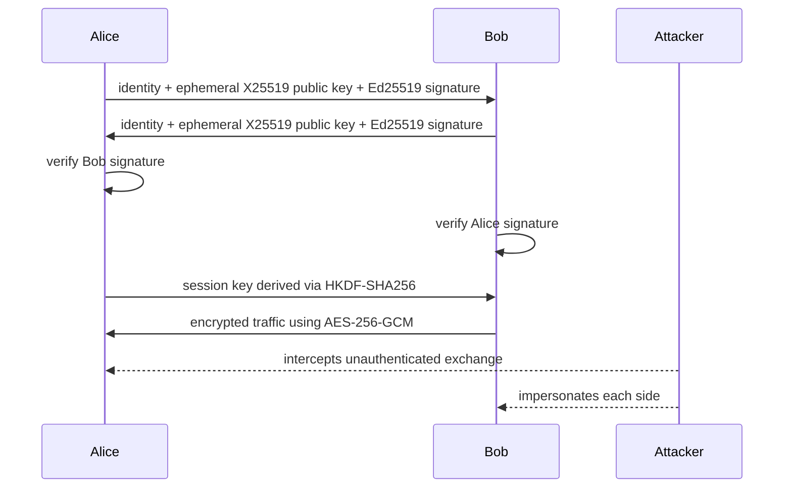

# 01 - Diffie-Hellman Ephemeral MITM Defense

## Objective

This project demonstrates how two participants can establish a secure shared session key over an untrusted network using X25519 ephemeral key agreement and Ed25519 identity authentication. It also shows why unauthenticated Diffie-Hellman is vulnerable to a man-in-the-middle attack.

## Architecture



## Cryptographic design

- Key agreement: X25519
- Authentication: Ed25519
- Key derivation: HKDF-SHA-256
- Symmetric encryption: AES-256-GCM
- Session keys: derived from shared secret, never used directly
- Nonces: generated using cryptographically secure randomness

## Security properties

- Confidentiality: protected through AES-256-GCM encryption
- Integrity: authenticated encryption detects tampering
- Authentication: Ed25519 signatures bind the ephemeral key to the identity
- Forward secrecy: fresh ephemeral keys are generated per session
- Key agreement: X25519 produces a shared secret without exposing the private keys

## Threats covered

- Passive eavesdropping
- Active MITM on unauthenticated DH exchange
- Replay of signed handshake messages
- Signature and identity forgery attempts
- Ciphertext, nonce, and metadata tampering

## Local setup

```bash
cd "Cryptography and Data Encryption/01-Diffie-Hellman-Ephemeral-MITM-Defense"
python -m venv .venv
. .venv/bin/activate  # Windows: .venv\Scripts\activate
pip install -r requirements.txt
```

## Run CLI demo

```bash
python -m src.dh_security.cli
```

## Run automated tests

```bash
pytest -q
```

## Expected output

The CLI prints:

- authenticated handshake success
- MITM attack outcome under unauthenticated DH
- MITM attack rejection under authenticated DH
- session key derivation from HKDF
- encryption/decryption round trip

## Limitations

- This is an educational implementation, not a full TLS protocol stack
- It demonstrates the core cryptographic pattern rather than a complete network protocol
- It does not include certificate chains, session resumption, or protocol negotiation
