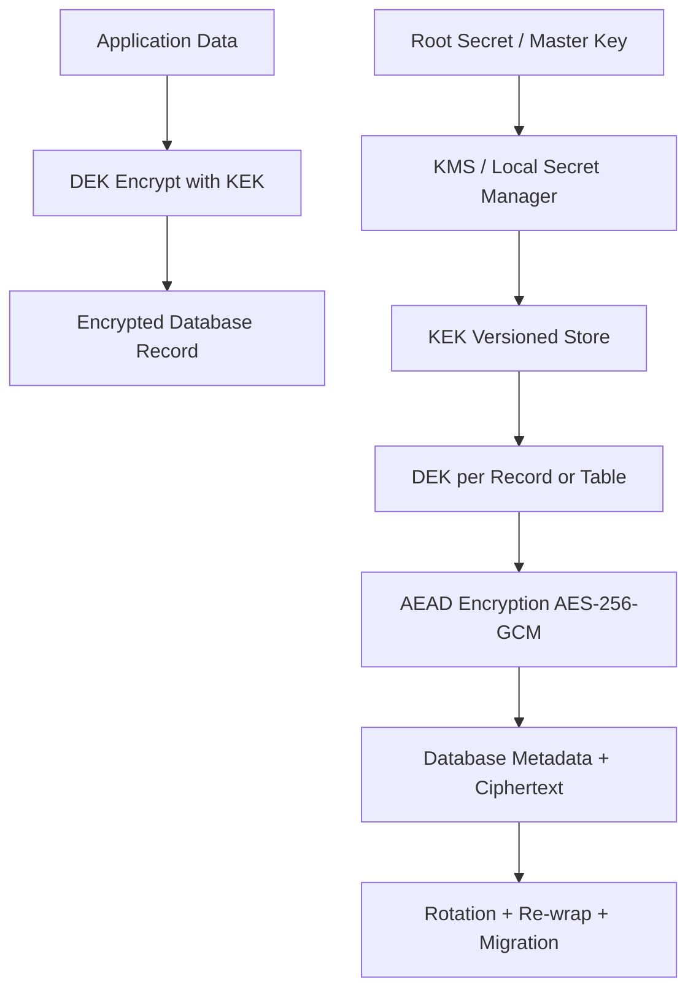

# 02 - Database TDE and Automated Secret Rotation

## Objective

This project models a secure application-level database encryption architecture using envelope encryption, versioned key management, and automated key rotation. It illustrates the distinction between a database engine with native transparent data encryption (TDE) and an application-managed encryption layer that protects sensitive data before it reaches storage.

## Architecture



## Key hierarchy

- Root / master key
- KEK (key encryption key)
- DEK (data encryption key)
- encrypted database data

## Cryptographic design

- Data encryption: AES-256-GCM
- Key wrapping: AES-256-GCM using KEK as an encryption key
- Secret management: local secure development provider with placeholder `.env.example`
- Key versioning: tracked in metadata and enforced on decrypt
- Rotation: rewrap DEKs from old KEK to new active KEK

## Security properties

- data at rest protection with envelope encryption
- metadata binding via AAD
- key version enforcement
- safe failure on tampering or revoked keys
- migration path for old data during rotation

## Distinction from native database TDE

A real database engine with native TDE encrypts the database files or storage layer. This project does not pretend to be a database-native engine; rather, it represents a secure application-layer design pattern that can later be integrated with external key managers or a DB-native TDE implementation.

## Local setup

```bash
cd "Cryptography and Data Encryption/02-Database-TDE-Automated-Secret-Rotation"
python -m venv .venv
. .venv/bin/activate  # Windows: .venv\Scripts\activate
pip install -r requirements.txt
pytest -q
```

## Run demo

```bash
python -m src.tde.demo
```

## Key rotation demo

```bash
python -m src.tde.rotation_demo
```

## Security notes

- The project does not hard-code secrets
- Secrets are loaded from environment variables or a local development secret store
- No plaintext master key is stored in the database
- Keys are never logged in plaintext
